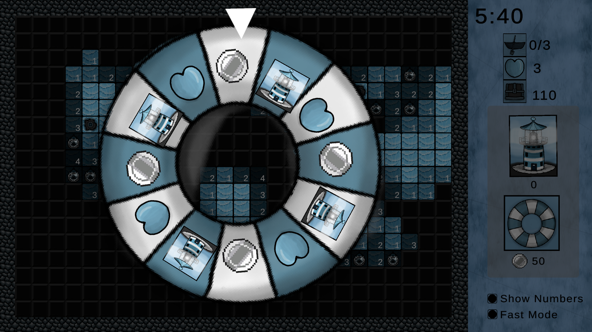

# Lost At Sea

Submitted for [McGameJam 2025](https://itch.io/jam/mcgame-jam-2025/entries) (Theme: Lost and Found)

Find the game on [Itch.io](https://lianl.itch.io/lost-at-sea)!

Made using Unity

Ay, ay sailor! Me name is Ber'n, I'm yer capt'n. Shiver me timbers, what a storm we have there tonight. Lots of blokes will fall to Neptune with such a weather. Unless you help them! Yer job will be to rescue these lost souls at sea so they don't get eaten by sharks. In this twisted take on minesweeper, build lighthouses at sea and find your mates before the sharks do! Their lives are in yer hand sailor!

   

### Controls:
- **Mouse:** Click and Drag to Drop Lighthouses

### Gameplay Overview:
- **Goal:** Find all of the lost boats while avoiding the sharks
- **Lighthouses:** Drag and drop lighthouses to uncover the sea
- **Gacha Wheel:** Spend 50 coins to spin the wheel for a chance to win coins, lighthouses, or extra lives!
- **Show Numbers:** Show numbers reveals exactly how many sharks surround a square
- **Fast Mode:** Fast mode reveals all adjacent empty tiles if the selected square is clear

### Levels:
- **Easy:** Like a gentle sea breeze—just a few waves to splash through
- **Medium:** Grab your compass and get ready for a steady, thrilling sail. Not too smooth, not too wild
- **Hard:** The sea’s angry, the sharks are hungry, and the treasure’s well hidden. Good luck, sailor!

### Screenshots:

          
          

          
          

          
          

          
          

